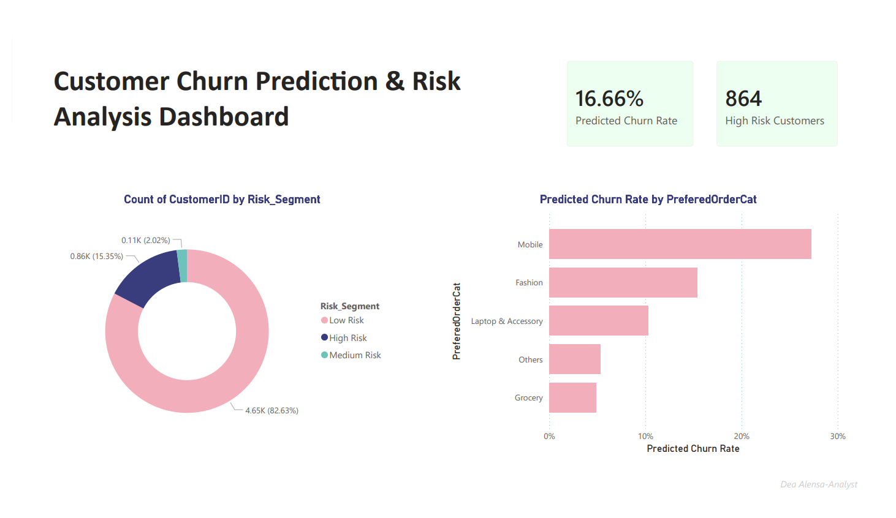

*Portfolio project by Dea Alensa · [LinkedIn](https://linkedin.com/in/deaalensa) · [Email](mailto:dea.alensa11@email.com)*

#  E-Commerce Customer Churn Analysis

> **Analyzing 5,630 customer records to identify key churn drivers and deliver actionable retention strategies.**



---

##  Background

Customer churn costs e-commerce companies significantly — acquiring a new customer is up to **5x more expensive** than retaining one. This project analyzes behavioral and demographic patterns of 5,630 customers to understand **who churns, why, and what can be done about it**.

---

##  Business Questions

1. What is the overall churn rate, and how significant is it?
2. Which customer segments are most at risk of churning?
3. Does complaint history or satisfaction score predict churn?
4. What behavioral patterns differentiate churned vs retained customers?

---

##  Key Findings

| Finding | Detail |
|---------|--------|
|  Overall churn rate | **16.8%** — 948 out of 5,630 customers churned |
|  New customers churn most | Customers in **first 0–3 months** have the highest churn (~36%) |
|  Complaints = high risk | Customers who complained churn at **31.7%** vs 10.9% without complaints |
|  Mobile category | Highest churn by order category at **27.4%** |
|  COD payment risk | Cash on Delivery users churn at **24.9%** |
|  Cashback gap | Retained customers earn **$20 more** cashback on average |

---

## Recommendations

1. **Onboarding campaign** for new customers (0–3 months) — personalized offers, tutorials, first-order incentives
2. **Automated complaint escalation** — fast resolution reduces churn risk significantly
3. **Cashback & loyalty program** targeted at low-satisfaction, high-risk users
4. **Mobile category UX audit** — investigate why mobile shoppers churn most
5. **Educate COD users** on digital payment benefits with incentives to switch

---

## Tech Stack


---

## How to Run

```bash
# 1. Clone repository
git clone https://github.com/deaalensa/ecommerce-churn-analysis.git

# 2. Install dependencies
pip install pandas numpy matplotlib seaborn openpyxl jupyter

# 3. Open notebook
jupyter notebook notebook.ipynb
```

Or open directly in Google Colab:
[](https://colab.research.google.com/drive/1jir6YrNOZ6gD7oDmq2duvVJMbObxS1ML?usp=sharing)

---

##  Dataset

- **Source:** E-Commerce Dataset (Kaggle)
- **Records:** 5,630 customers
- **Features:** 20 columns (demographics, behavior, transaction history)
- **Target variable:** `Churn` (1 = churned, 0 = retained)

---

*Portfolio project by Dea Alensa · [LinkedIn](https://linkedin.com/in/deaalensa) · [Email](mailto:dea.alensa11@gmail.con)*
